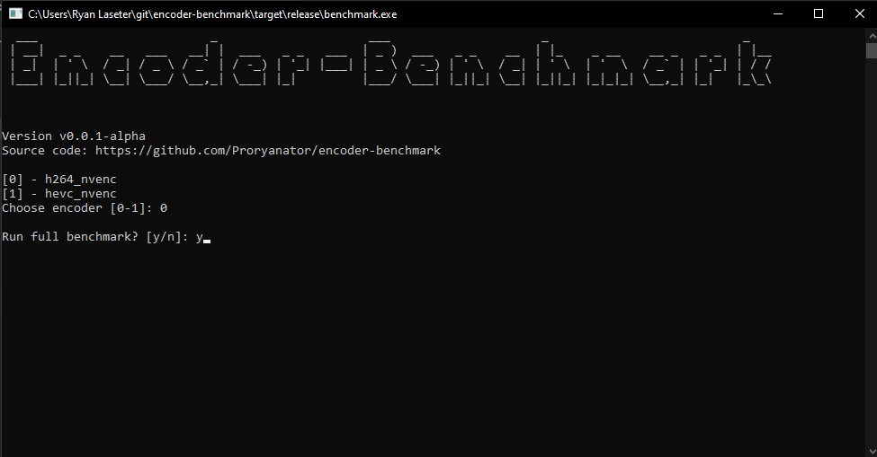

## Realtime Video Encoding/Decoding Tools

### Contents

- [Overview](#overview)
- [Supported Encoders](#supported-encoders)
- [Minimum System Specs Suggested](#minimum-system-specs-suggested)
- [Installation and Setup](#installation-and-setup)
- [Benchmark Tool Quick Run Guide](#benchmark-tool-quick-run-guide)
- [Permutor Cli Quick Run Guide](#permutor-cli-quick-run-guide)
- [Permutor Cli Common Commands and Use Cases](#permutor-cli-common-commands-and-use-cases)
- [Contributing](#contributing)
- [Building the Entire Tool Locally and Running](#building-the-entire-tool-locally-and-running)
- [Adding Support for New Encoder](#adding-support-for-new-encoders)
- [Troubleshooting](#troubleshooting)

If you are curious on research findings or other nitty-gritty details about this project, see the
project's <a href='https://github.com/Proryanator/encoder-benchmark/wiki'>wiki</a>.

## Overview

### Project Goals

This project aims to be _the_ standardized video encoding benchmark, easily accessible to all. The tools provided here
can:

- easily compare GPU encoders of different generations, in terms of produced quality and maximum fps with ease
- help identify optimal video encoder settings & bitrates for emerging hardware and new encoders
- help you identify the maximum possible achievable quality at a given bitrate, resolution, and fps for your hardware
- identify maximum capabilities to be applied to OBS Studio, or author's
  suggested [Game Streaming Software](#streaming-host--client-software-suggestions) for streaming games anywhere
- identify optimal encoder settings that allow you to squeeze the most quality out of a bitrate limited streaming
  environment, such as streaming to Twitch or Youtube at low bitrates

### The Two Tools

- **benchmark** - one-click pre-configured encoding benchmark that runs on your chosen encoder, useful for a quick-check
  of your GPU's performance at various resolutions/framerates
- **permutor-cli** - command-line tool to iterate over all possible encoder settings and bitrates to find
  encoder limitations, in both performance and quality

### Which Tool is Right for You

To compare your own system's capabilities to another, or to determine at a high-level the maximum _fps_ that your
hardware can encode, run the **benchmark**. This will give you performance statistics of your
hardware, at resolutions ranging from 720p up to 4K, and framerates of 60fps and 120fps.

For more advanced users, if you are wanting to determine optimal encoder settings that work best on your GPU/system, or
are curious about emerging GPU encoder performance that has not yet been researched, you'll be most interested in the
**permutor-cli** tool. This automates the tedious setting, bitrate, resolution/fps, and encoded video quality testing
that you would have to do on your own by hand. (People often do this in OBS Studio **by hand** to see how much quality
they can squeeze out of 1080@60 H264 @ 6Mb/s, and when determining whether their GPU can even stream at very high
resolutions and framerates).

## Supported Encoders

Note: encoders marked with a <b>*</b> support benchmarking of encoding/decoding capabilities; otherwise only encoding is
supported.

- ***Nvidia NVENC H264/HEVC** (h264_nvenc, hevc_nvenc)
- ***AMD H264/HEVC** (h264_amf, hevc_amf)
- **Intel Quick Sync Video H264/HEVC** (h264_qsv, hevc_qsv)
- ***Intel Arc AV1** (av1_qsv)
- **Apple Silicon H264/HEVC permutations (h264_videotoolbox, hevc_videotoolbox)**

The following have code in the project to 'support it' but currently <i>do not</i> function correctly.

- **Apple Silicon Benchmarks of Any Kind** (just don't work right now)
- **Apple Silicon ProRes (prores_videotoolbox)**

## Minimum system specs suggested

- <b>OS:</b> Windows, Mac or Linux
- <b>Processor:</b> CPU with at least 6 cores (for macbooks, Intel _should_ work, but Apple Silicon for sure has been tested)
- <b>GPU:</b> Nvidia GPU w/ a hardware encoder, in the main x16 PCI slot of your PC (for max PCI bandwidth)
- <b>Memory:</b> >= 8GB RAM (higher is always better)
- <b>Storage Space:</b> 3-12GB depending on target resolution/framerate, 90GB for the full benchmark
- <b>Extra Space:</b> When running encode & decode benchmark, allow for 12GB of additional free space (on top of 90GB)
- <b>Storage Type/Speed:</b>
    - if benchmarking <= 2k@60, any SATA SSD will work just fine
    - if benchmarking >= 2k@120, you MUST use an m.2 nvme drive with speeds upwards of 1.1GB/s

  (See [SSD Read Speed Requirements](#ssd-read-speed-requirements) for specific details)

A nice cross-platform tool to test your SSD's sequential read speeds: <a href='https://www.jazzdiskbench.com/'>Jazz Disk
Bench</a>

Note: the tool _does_ support selecting a specific GPU in your system if you have more than one, but you may experience
PCI bottlen-ecking for GPU's not in the primary slot.

### Important notes about your system

- do make sure your SSD drive in Windows does _not_ have drive compression enabled. This can severely affect your
  sequential read speeds, which is very important for reading high resolution/fps input files
- the tool supports multiple Nvidia GPU's in your system for both the benchmark & permutor-cli tool, so you can feel
  free to have more than 1 for your testing (although the benchmark would only run against one)
- the tool does _not_ support multiple AMD GPU's for the benchmark tool, but you are able to still specify _-gpu_ with
  the permutor-cli tool
- for AV1 on Intel Arc, make sure the monitor plugged into the Arc GPU is your primary monitor, otherwise ffmpeg may not
  use/pickup the GPU

---

## Installation and Setup

Note: tool has been tested with ffmpeg version `6.0` (this version comes bundled with AV1 hardware encoding support), so
it's highly suggested to use the same version, or at least version `6.*` of ffmpeg/ffprobe.

1) Installation of <a href='https://ffmpeg.org/download.html'>ffmpeg</a>

    - For Windows, recommend downloading the binaries for Windows from <a href='https://www.gyan.dev/ffmpeg/builds/'>
      gyan.dev</a>, specifically the `ffmpeg-release-full` one, which should include all needed features and tools
    - For Mac, recommended to install via `brew install ffmpeg` (will install ffpmpeg and ffprobe)
    - For Linux, recommended to install using your distro's package manager. Note: the default one may be a much lower
      version than `6.0` and may require more setup
2) <a href='https://www.7-zip.org/download.html'>7-Zip</a> to unzip any downloaded ffmpeg binaries
3) ffmpeg/ffprobe must be available on your path (tool will error out if it can't find
   either); <a href='https://www.architectryan.com/2018/03/17/add-to-the-path-on-windows-10/'>quick path setup guide for
   Windows
   10+</a>. Note: when following those instructions do make sure to add the `ffmpeg_folder\bin` directory to your path (
   any other directory will not work)
4) Download either the **benchmark** tool or the **permutor** tool (depending on your use case) for your platform from
   the <a href='https://github.com/Proryanator/encoder-benchmark/releases'>release section</a> of this repo onto the SSD
   that you wish to run the benchmark on
5) Download the source files
   from <a href='https://utsacloud-my.sharepoint.com/:f:/g/personal/hlz000_utsa_edu/EgkZZbJam-pAveNLTapnaOYB8gOvyx2naqV9NyIDb5c03A?e=hIfmLH'>
   here</a> (you may need to
   download individual files if the .zip is too large)
6) Extract all the source files to the target SSD you wish to read the files form (same folder as the tool)

---

## Benchmark Tool Quick Run Guide

### Running the benchmark tool

Assuming you have followed the [Installation Setup Requirements](#installation--setup-requirements), running the
benchmark is as simple as:

1) Opening the **benchmark** executable as you would any other program (double-click)
2) Follow the on-screen instructions:

- select your GPU (if you have more than 1, otherwise it auto-selects your only
  card)
- select your encoder
- select whether you want to benchmark encoding & decoding, or just encoding
- select whether to run the benchmark on all resolutions or just a specific one
- select whether you want to run it in verbose mode for extra logging (useful for error debugging)

3) Wait for the benchmark to finish, which should not take that long



### Stopping the tool

Kill the tool at any time by hitting `ctrl-c` in the terminal/console where the tool is running.

### Understanding the results

You'll be given the maximum fps statistics possible at a given resolution, with those results logged out to a
**benchmark.log** file:

```text

[Permutation:   1/8]
[Resolution:    1280x720]
[Encoder:       h264_nvenc]
[FPS:           60]
[Bitrate:       10Mb/s]
[-preset p1 -tune ll -profile:v high -rc cbr -cbr true]
  [00:00:01] [###########################] 1800/1800 frames (00:00:00)
  Average FPS:  867 
  1%'ile:       660 
  90%'ile:      1014

(Other resolutions will be here)

[Permutation:   8/8]
[Resolution:    3840x2160]
[Encoder:       h264_nvenc]
[FPS:           120]
[Bitrate:       110Mb/s]
[-preset p1 -tune ll -profile:v high -rc cbr -cbr true]
  [00:00:29] [###########################] 2383/2383 frames (00:00:00)
  Average FPS:  83
  1%'ile:       48
  90%'ile:      86

Benchmark runtime: 1m33s
```

Note: the encoder settings used, in this example `-preset p1 -tune ll -profile:v high -rc cbr -cbr true`, are preset by
the author from his findings of what settings produced the _highest possible fps_.

You may also wonder why the _bitrate_ varies for each resolution & framerate, and where those values were pulled from.
With use of the **permutor-cli** tool the author was able to determine that bitrates above the set amount do not provide
any noticeable improvement in encode quality.

For more in-depth analysis of the fps statistics and what it tells you,
see [How to Interpret FPS Statistics](#how-to-interpret-fps-statistics).

## Permutor Cli Quick Run Guide

Note: the **permutor-cli** tool is designed to be run from a terminal or command-line, and will not work if you
double-click it like the **benchmark** will.

### Viewing all supported options

For a complete list of all command line arguments and what they mean, run:

`./permutor-cli -h`

For the most part, options are self-explanatory, however see
some [common use cases](#permutor-cli-common-commandsuse-cases) for a clearer understanding.

### Stopping the tool

Kill the tool at any time by hitting `ctrl-c` in the terminal/console where the tool is running.

## Permutor Cli Common Commands and Use Cases

### Identifying the best encoder settings for a given resolution, framerate, and bitrate

Unlike the **benchmark** which will run _one permutation_ over every resolution & framerate combination supported,
the **permutor-cli** tool will instead iterate over different encoder setting permutations for a fixed resolution &
framerate.

For the below example, we are wanting to run over all possible encoder settings, at 20Mb/s, for the h264_nvenc encoder,
targeted at 4K@60, checking the encoded output's quality:
`./permutor-cli -e h264_nvenc -s 4k-60.y4m -b 20 -c`

We happen to know that 20Mb/s is _way too low_ of a bitrate for 4K@60, no matter your encoder settings. This tool also
supports slowly increasing the bitrate to help you find the _minimum bitrate needed_ to get visually lossless game
streaming at a target resolution & framerate.

### Identifying the minimum bitrate needed to achieve visually lossless video quality

If you are unsure on the definition of visually lossless quality,
see the wiki's terminology section.

To find the minimum bitrate & encoder settings needed to achieve visually lossless quality, you would run something like
the following:

`./permutor-cli -e h264_nvenc -s 4k-60.y4m -c -b 10 -m 100`

In this example, the tool will iterate over all possible encoder settings for h264_nvenc, at bitrates between
**[10, 15, 20, ..., 100 Mb/s]**, until visually lossless output quality is found (video encode having a vmaf score >=
95).

When the tool detects that you've hit a `95` vmaf score, it will stop permuting. In the above example, the tool would
stop permuting once it gets to `50Mb/s` because we know that's the point where you get visually lossless 4K@60 with
H264_NVENC, and any higher amount of bitrate does not significantly improve quality and can actually reduce encoder
performance.

### Running on a specific GPU in a multi-GPU system

By default, the **permutor-cli** tool will run against the first GPU in your system that it sees.

Much like how the benchmark tool allows for you to select what GPU to run on, the **permutor-cli** tool does this as
well.
With this tool it's as simple as providing the `-gpu 0` option, where 0 in this case would run against your first GPU.

Note: if you are not sure which GPU is considered in the first slot, open the **benchmark** and it'll list the order of
your cards for you.

### SSD Read Speed Requirements

Here's the sequential read speeds you'll need to benchmark specific resoultion & fps combos. If your SSD is not fast
enough, your maximum fps scores will be lower due to i/o bottlenecking.

```text
(Target)   (Sequential Read in MB/s)
720@60              85
720@120             165
1080@60             190
1080@120            375
2k@60               340
2k@120              680
4k@60               750
4k@120              1100
```

---

## Feature Requests, Bugs or Issues

The author plans to add more encoder support, run the benchmark on a wide variety of hardware, and much much more.
However, if you have an idea or feature you would like this tool to have, feel free to create an issue in the repository
and the various contributors will get back to you.

This also applies to issues that you might find with existing features.

Screenshots or log file uploads are much appreciated!

---

## Contributing

This project welcomes any and all contributors! Especially those interested in adding Linux support. Feel free to assign
issues to yourself, start discussions, or reach out to the author in his Discord
server <a href='https://discord.gg/pgFmZgRxUU'>here</a>.

### Rust Version

Project is written in Rust, with version `1.73.0` at time of writing.

### RustRover IDE (suggested by Author)

The author uses <a href='https://www.jetbrains.com/rust/'>RustRover</a> for most of his Rust development, although
you're more than welcome to use other IDE's.

#### Setting up automatic formatting via rustfmt in RustRover

It's suggested that you setup automatic formatting in RustRover to avoid the `rustfmt` job failing and blocking your PR.

Go to Settings -> Languages and Frameworks -> Rust -> Rustfmt, and
enable `Use Rustfmt instead of the build-in formatter` and `Run Rustfmt automatically on Save`.


### Visual Studio Code

You can also use VSCode if you want when contributing to the project. Make sure you have the
plugin <a href='https://marketplace.visualstudio.com/items?itemName=rust-lang.rust-analyzer'>rust-analyzer</a> which
seems to already have a built-in formatter for rust.

Just make sure you enable formatting on save via `Settings -> Search for 'format' -> toggle 'Editor: Format On Save'`


### Building the Entire Tool Locally and Running

Sometimes the terminal in your IDE may not render the results the best, so you may want to run a full
permutation/benchmark in the background. Here's how to build the tool and do just that.

1. Run `cargo build --release` to generate the binaries
2. Run `./target/release/permutor-cli` or `./target/release/benchmark` respectively (adjust with `.exe` for Windows)

### Adding Support for New Encoders

To help with onboarding new encoders/vendors (and know how existing ones are supported), here is a step-by-step guide to
adding support for a new encoder:

#### Adding in CLI Support for the Encoder

This will make the cli tool aware of the new encoder.

1. Add a new entry into the file `cli/src/supported.rs` matching the string of the `encoder=` argument usually provided
   to ffmpeg, i.e. `h264_nvenc` is the string used by ffmpeg to use the Nvidia H264 encoder
2. Add a new entry into the file `codecs/src/vendor.rs` and update any references to the Vendor in the project to use
   the newly added one (named whatever matches the vendor/manufacturer of the GPU/CPU), i.e. `Nvidia`, `AMD`, etc.
3. Update a method called `get_vendor_for_codec` that maps the ffmpeg `encoder=` string to the new Vendor that was
   added, in `codecs/src/lib.rs`
4. Add a new method in `permutor-cli/src/main.rs` that will be used to init the encoder's permutation (see any of the
   existing methods at the bottom).
5. Update the `main` method in `permutor-cli/src/main.rs` to now call your newly added init() method depending on the
   vendor
6. Update `Supported Encoders` section of the readme for full transparency of the supported encoders

#### Implementing the Permutation Engine for the Encoder

Now that the cli tool is aware of the new encoder, we still need to add in some custom logic for building ffmpeg
arguments specific to this encoder. We'll do that now.

1. Add a new file, properly named based on your encoder, under `codecs/src` (feel free to copy any of the other files)
2. Using what options you see from `ffmpeg -h encoder=encoder_name`, fill out the various structs of data
3. Update the methods that build the permutations, including ones that provide a standardized ffmpeg permutation (this
   is what would be used by the benchmark portion of this tool)

#### Checklist for Fully Functional Implementation

These things should be checked to make sure that the newly added encoder works as designed:

1. All permutations should run w/o consistent failures (to check for any ffmpeg errors when trying to run a permutation)
2. Verify that the new encoder can correctly generate a VMAF score by using the `-c` flag
3. You have set (even if a placeholder) a benchmark encoding permutation to use
4. Verify that you are able to run a benchmark for your given newly added encoder
5. Verify your new encoder also works when decoding as part of the benchmark run (just in case) via the `-d` argument
6. As part of running permutations, determining the bitrate that provides lossless quality for a given resolution is
   important. After running through bitrate permutations (by using `-m` and providing a bitrate maximum range to test
   with). Once you know a good bitrate for a specific encoder/resolution, you'll want to add that mapping into the
   encoder's file function `get_resolution_to_bitrate_map`

#### Deciding What Arguments to Use for Benchmarking Tool

Since the benchmark part of this project is intended to maximize FPS performance, you'll want
to hand-select the best performing encoder arguments based on running full permutations on your encoder.

An example of what the author did for the nvenc_h264 encoder:

1. Ran a full permutation of all available nvenc_h264 encoder settings, producing an output file of statistics
2. Identified a handful (usually there's not just 1) of encoder setting permutations that produces the highest fps
3. Those encoder settings are then set as the default benchmark settings

### Troubleshooting

<i>Error about unsupported feature</i>

If you are getting the following: `#![feature] may not be used on the stable release channel`, this should be fixable by
running `cargo clean`.