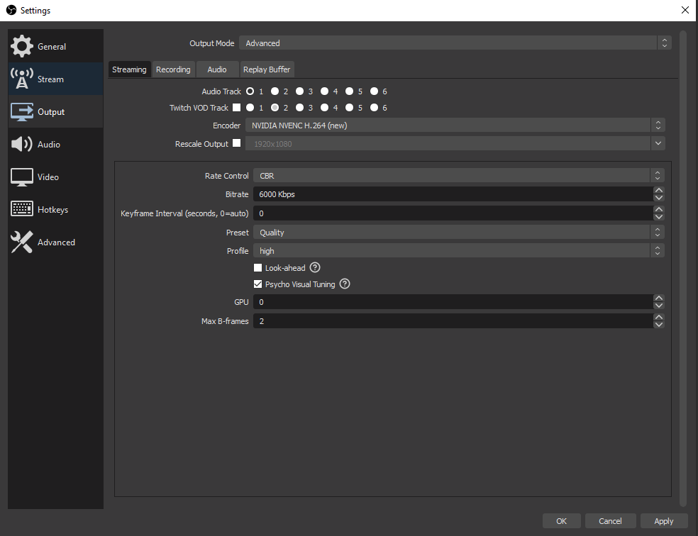
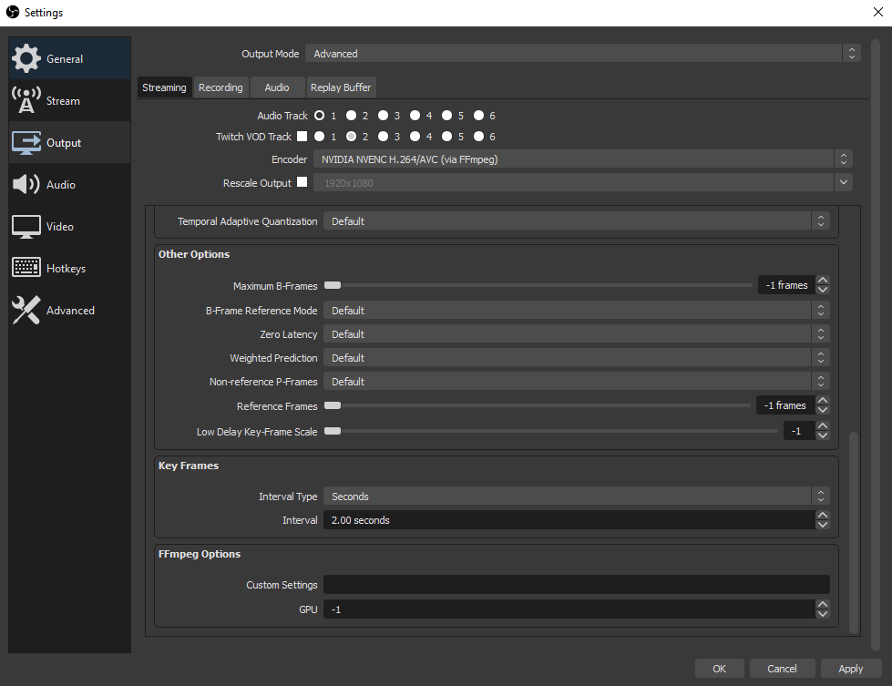

## Realtime Video Encoding Tools

### Contents

- [Overview](#overview)
- [Supported Encoders](#supported-encoders)
- [Minimum System Specs Suggested](#minimum-system-specs-suggested)
- [Installation and Setup](#installation-and-setup)
- [Benchmark Tool Quick Run Guide](#benchmark-tool-quick-run-guide)
- [Permutor Cli Quick Run Guide](#permutor-cli-quick-run-guide)
- [Permutor Cli Common Commands and Use Cases](#permutor-cli-common-commands-and-use-cases)
- [Applying your Findings](#applying-your-findings)
- [Author's Research Findings and Discussion](#authors-research-findings-and-discussion)

## Overview

### Project Goals

This project aims to be _the_ standardized video encoding benchmark, easily accessible to all. The tools provided here
can:

- easily compare GPU encoders of different generations, in terms of produced quality and maximum fps with ease
- help identify optimal video encoder settings & bitrates for emerging hardware and new encoders
- help you identify the maximum possible achievable quality at a given bitrate, resolution, and fps for your hardware
- identify maximum capabilities to be applied to OBS Studio, or author's
  suggested [Game Streaming Software](#streaming-host--client-software-suggestions) for streaming games anywhere
- identify optimal encoder settings that allow you to squeeze the most quality out of a bitrate limited streaming
  environment, such as streaming to Twitch or Youtube at low bitrates

### The Two Tools

- **benchmark** - one-click pre-configured encoding benchmark that runs on your chosen encoder, useful for a quick-check
  of your GPU's performance at various resolutions/framerates
- **permutor-cli** - command-line tool to iterate over all possible encoder settings and bitrates to find
  encoder limitations, in both performance and quality

### Which Tool is Right for You

To compare your own system's capabilities to another, or to determine at a high-level the maximum _fps_ that your
hardware can encode, run the **benchmark**. This will give you performance statistics of your
hardware, at resolutions ranging from 720p up to 4K, and framerates of 60fps and 120fps.

For more advanced users, if you are wanting to determine optimal encoder settings that work best on your GPU/system, or
are curious about emerging GPU encoder performance that has not yet been researched, you'll be most interested in the
**permutor-cli** tool. This automates the tedious setting, bitrate, resolution/fps, and encoded video quality testing
that you would have to do on your own by hand. (People often do this in OBS Studio **by hand** to see how much quality
they can squeeze out of 1080@60 H264 @ 6Mb/s, and when determining whether their GPU can even stream at very high
resolutions and framerates).

## Supported Encoders

- **Nvidia NVENC H264/HEVC** (h264_nvenc, hevc_nvenc)
- **AMD H264/HEVC** (h264_amf, hevc_amf)
- **Intel Quick Sync Video H264/HEVC** (h264_qsv, hevc_qsv)

Note, no support for software/CPU encoding or AV1 hardware encoding exists yet.

## Minimum system specs suggested

- <b>OS:</b> Windows (will support more OS's eventually)
- <b>Processor:</b> CPU with at least 6 cores
- <b>GPU:</b> Nvidia GPU w/ a hardware encoder, in the main x16 PCI slot of your PC (for max PCI bandwidth)
- <b>Memory:</b> >= 8GB RAM (higher is always better)
- <b>Storage Space:</b> 3-12GB depending on target resolution/framerate, 90GB for the full benchmark
- <b>Storage Type/Speed:</b>
    - if benchmarking <= 2k@60, any SATA SSD will work just fine
    - if benchmarking >= 2k@120, you MUST use an m.2 nvme drive with speeds upwards of 1.1GB/s

  (See [SSD Read Speed Requirements](#ssd-read-speed-requirements) for specific details)

A nice cross-platform tool to test your SSD's sequential read speeds: <a href='https://www.jazzdiskbench.com/'>Jazz Disk
Bench</a>

Note: the tool _does_ support selecting a specific GPU in your system if you have more than one, but you may experience
PCI bottlenecking for GPU's not in the primary slot.

### Important notes about your system

- do make sure your SSD drive in Windows does _not_ have drive compression enabled. This can severely affect your
  sequential read speeds, which is very important for reading high resolution/fps input files
- the tool supports multiple Nvidia GPU's in your system for both the benchmark & permutor-cli tool, so you can feel
  free to have more than 1 for your testing (although the benchmark would only run against one)
- the tool does _not_ support multiple AMD GPU's for the benchmark tool, but you are able to still specify _-gpu_ with
  the permutor-cli tool

---

## Installation and Setup

Note: tool has been tested with ffmpeg version `5.1.2`, so it's highly suggested to use the same version, or at least
version `5.*` of ffmpeg/ffprobe.

1) Installation of <a href='https://ffmpeg.org/download.html'>ffmpeg</a>

    - For Windows, recommend downloading the binaries for Windows from <a href='https://www.gyan.dev/ffmpeg/builds/'>
      gyan.dev</a>, specifically the `ffmpeg-release-full` one, which should include all needed features and tools
    - For Mac/Linux, install both `ffmpeg` and `ffprobe` at mentioned versions above
2) <a href='https://www.7-zip.org/download.html'>7-Zip</a> to unzip any downloaded ffmpeg binaries
3) ffmpeg/ffprobe must be available on your path (tool will error out if it can't find
   either); <a href='https://www.architectryan.com/2018/03/17/add-to-the-path-on-windows-10/'>quick path setup guide for
   Windows
   10+</a>
4) Download either the **benchmark** tool or the **permutor** tool (depending on your use case) for your platform from
   the <a href='https://github.com/Proryanator/encoder-benchmark/releases'>release section</a> of this repo onto the SSD
   that you wish to run the benchmark on
5) Download the source files
   from <a href='https://www.dropbox.com/sh/x08pkk47lc1v5ex/AADGaoOjOcA0-uPo7I0NaxL-a?dl=0'>here</a> (you may need to
   download individual files if the .zip is too large)
6) Extract all the source files to the target SSD you wish to read the files form (same folder as the tool)

---

## Benchmark Tool Quick Run Guide

### Running the benchmark tool

Assuming you have followed the [Installation Setup Requirements](#installation--setup-requirements), running the
benchmark is as simple as:

1) Opening the **benchmark** executable as you would any other program (double-click)
2) Follow the on-screen instructions:

- select your GPU (if you have more than 1, otherwise it auto-selects your only
  card)
- select your encoder
- select whether to run the benchmark on all resolutions or just a specific one
- select whether you want to run it in verbose mode for extra logging (useful for error debugging)

3) Wait for the benchmark to finish, which should not take that long


### Stopping the tool

Kill the tool at any time by hitting `ctrl-c` in the terminal/console where the tool is running.

### Understanding the results

You'll be given the maximum fps statistics possible at a given resolution, with those results logged out to a
**benchmark.log** file:

```text

[Permutation:   1/8]
[Resolution:    1280x720]
[Encoder:       h264_nvenc]
[FPS:           60]
[Bitrate:       10Mb/s]
[-preset p1 -tune ll -profile:v high -rc cbr -cbr true]
  [00:00:01] [###########################] 1800/1800 frames (00:00:00)
  Average FPS:  867 
  1%'ile:       660 
  90%'ile:      1014

(Other resolutions will be here)

[Permutation:   8/8]
[Resolution:    3840x2160]
[Encoder:       h264_nvenc]
[FPS:           120]
[Bitrate:       110Mb/s]
[-preset p1 -tune ll -profile:v high -rc cbr -cbr true]
  [00:00:29] [###########################] 2383/2383 frames (00:00:00)
  Average FPS:  83
  1%'ile:       48
  90%'ile:      86

Benchmark runtime: 1m33s
```

Note: the encoder settings used, in this example `-preset p1 -tune ll -profile:v high -rc cbr -cbr true`, are preset by
the author from his findings of what settings produced the _highest possible fps_.

You may also wonder why the _bitrate_ varies for each resolution & framerate, and where those values were pulled from.
With use of the **permutor-cli** tool the author was able to determine that bitrates above the set amount do not provide
any noticeable improvement in encode quality.

For more in-depth analysis of the fps statistics and what it tells you,
see [How to Interpret FPS Statistics](#how-to-interpret-fps-statistics).

## Permutor Cli Quick Run Guide

Note: the **permutor-cli** tool is designed to be run from a terminal or command-line, and will not work if you
double-click it like the **benchmark** will.

### Viewing all supported options

For a complete list of all command line arguments and what they mean, run:

`./permutor-cli -h`

For the most part, options are self-explanatory, however see
some [common use cases](#permutor-cli-common-commandsuse-cases) for a clearer understanding.

### Stopping the tool

Kill the tool at any time by hitting `ctrl-c` in the terminal/console where the tool is running.

## Permutor Cli Common Commands and Use Cases

### Identifying the best encoder settings for a given resolution, framerate, and bitrate

Unlike the **benchmark** which will run _one permutation_ over every resolution & framerate combination supported,
the **permutor-cli** tool will instead iterate over different encoder setting permutations for a fixed resolution &
framerate.

For the below example, we are wanting to run over all possible encoder settings, at 20Mb/s, for the h264_nvenc encoder,
targeted at 4K@60, checking the encoded output's quality:
`./permutor-cli -e h264_nvenc -s 4k-60.y4m -b 20 -c`

We happen to know that 20Mb/s is _way too low_ of a bitrate for 4K@60, no matter your encoder settings. This tool also
supports slowly increasing the bitrate to help you find the _minimum bitrate needed_ to get visually lossless game
streaming at a target resolution & framerate.

### Identifying the minimum bitrate needed to achieve visually lossless video quality

If you are unsure on the definition of visually lossless quality,
see [Visually Lossless Terminology](#visually-lossless-terminology).

To find the minimum bitrate & encoder settings needed to achieve visually lossless quality, you would run something like
the following:

`./permutor-cli -e h264_nvenc -s 4k-60.y4m -c -b 10 -m 100`

In this example, the tool will iterate over all possible encoder settings for h264_nvenc, at bitrates between
**[10, 15, 20, ..., 100 Mb/s]**, until visually lossless output quality is found (video encode having a vmaf score >=
95).

When the tool detects that you've hit a `95` vmaf score, it will stop permuting. In the above example, the tool would
stop permuting once it gets to `50Mb/s` because we know that's the point where you get visually lossless 4K@60 with
H264_NVENC, and any higher amount of bitrate does not significantly improve quality and can actually reduce encoder
performance.

### Running on a specific GPU in a multi-GPU system

By default, the **permutor-cli** tool will run against the first GPU in your system that it sees.

Much like how the benchmark tool allows for you to select what GPU to run on, the **permutor-cli** tool does this as
well.
With this tool it's as simple as providing the `-gpu 0` option, where 0 in this case would run against your first GPU.

Note: if you are not sure which GPU is considered in the first slot, open the **benchmark** and it'll list the order of
your cards for you.

## Applying your Findings

This section details out how to use knowledge you've gained from this tool in software like Sunshine, Moonlight, OBS
Studio, and many more.

### Updating Encoder Settings in Sunshine

We'll first be discussing how to change encoder settings in Sunshine. Bitrate settings will not be something you can set
in Sunshine, but will be something you can change in your Moonlight app on your computer or other streaming device.

As of February 2023, Nvidia is stopping support of it's own home GameStream service bundled with GeForce Experience.
Introducing <a href='https://github.com/LizardByte/Sunshine/releases'>Sunshine</a>, the open-source alternative that
runs on your gaming rig, and encodes your gameplay footage to be streamed to other devices, like another computer or
even your phone. Sunshine, unlike other streaming programs like Nvidia's GameStream, allows you to customize some
encoding settings that can often out-perform Nvidia's GameStream program.

Note: we'll assume that you already have a Sunshine server setup and that you have attached at least one client device.
Sunshine sets some encoder settings by default, at the time of writing this, for Nvidia encoders the default preset
is `p4`. You can view the currently used encoder settings by going
to `youripaddress:47990 -> Web UI -> Configuration -> NVIDIA NVENC Encoder / Intel QuickSync Encoder / AMD AMF Encoder`.

Let's say that using the tools in this project, you identified that of all the possible encoder settings for NVENC_H264
on your 3080, the settings that allowed you to encode 4K@120 were:

`-preset p1 -tune ll -profile:v high -rc cbr`

To apply these settings in Sunshine (for Nvidia), go to `Web UI -> Configuration -> NVIDIA NVENC Encoder` and change to
the following values in the dropdowns:

```
NVENC Preset: p1 -- fastest (lowest quality)
NVENC Tune: ll -- low latency
NVENC Rate Control: cbr -- constant bitrate
```

You may have noticed that you could not set the profile for the encoder in Sunshine. Sunshine does not expose _all_
encoder settings, but exposes the ones that make the most impact to your encode (most likely Sunshine defaults profile
to high). Perhaps in a future update you'll be able to specify more settings but, for now you may be limited.

Once you've saved these settings, Sunshine will now encode your game using your specific settings, enabling you to
stream at potentially higher framerates, or framerates with higher 1% lows than before. (Author was not able to get
higher than 4K@90 with default settings in Sunshine and Nvidia's GameStreaming service, but with the findings from this
tool, is able to get stable 4K@120).

### Applying Bitrate Knowledge in Moonlight App

When using Moonlight as your game streaming client, it auto-recommends a bitrate for you to stream at. Most of the time
this is pretty accurate for lower resolutions, however depending on your hardware's capabilities you might be able to
get away with less bitrate than it suggests. Even moreso, some AMD GPU's need way more bitrate than Nvidia cards, so
you'll want to know if you'll need much higher bitrates.

For example: Moonlight auto-selects `80Mb/s` for streaming 4K@60 game content. However from our testing, you really only
need `50Mb/s` when encoding using H264_NVENC. Notice that this applies to _nvenc_ encoders on Nvidia GPU's, and may or
may not apply for other vendor GPU's, even using the same H264 algorithm.

After running the tool on a 4K@60 input file, we know we can get a visually lossless streaming experience with just
50Mb/s on our Nvidia GPU. We also know that, if we are attempting to stream our games outside our home network, we know
that our cellular connection speeds or wifi speeds should be at least 50Mb/s to get a clean 4K@60. In addition to this,
our gaming rig (and home network upload speeds) should also be capable of 50Mb/s.

The tools here enable you to know whether you can actually stream to where you are, or if you are bitrate limited,
encoder hardware limited, or somewhere in-between. It's easier to know if you can stream games to your phone while on
cellular data, and know what resolution & framerate to set your stream to given that you are bitrate limited.

### Streaming with OBS Studio

For the most part, if the encoder that you're interested in using to stream with is supported in OBS Studio, you'll be
able to apply the settings identified that product the highest FPS or highest quality of a stream at a given bitrate
directly in OBS Studio's Settings -> Output area like you normally would.

For example, you can just set the preset, profile, and tune if you are Streaming/Recording using OBS Studio:



With the use of a very useful plugin called <a href='https://github.com/Xaymar/obs-StreamFX'>StreamFX</a> you can gain
access to passing in even more encoder settings via the UI, in addition to passing arguments directly to ffmpeg itself
as well.

If use of the standard preset, tune, and profile settings are not granular enough for you, you can always mess with
additional settings via this plugin:



**Note:** there most likely will be a performance hit when applying the same settings that you saw from use of the tools
in this project. This is due to some potential overhead in the way that OBS Studio does encoding but, you should be able
to get very close to the performance/quality that the tools here identify.

---

## Author's Research Findings and Discussion

A _lot_ of research has gone into the development of this tool, and some decisions were made along the way that might
not be obvious to why some conclusions were drawn. This section is also for you if you are interested in some
nitty-gritty details of video encoding, from SSD i/o read speed limitations, framerate statistics, and some design
decisions of the tool made by the author during development.

### Streaming Host & Client Software Suggestions

The author suggests using the following tools:

- *Moonlight* - an open-source game streaming client that provides insane low-latency streaming, with a very helpful
  stats overlay
- *Sunshine*  - an open-source version of GeForce Experience with encoder setting customization

They will be referenced throughout the README in various examples, and can be downloaded
from <a href='https://moonlight-stream.org/'>here</a>.

### SSD Read Speed Requirements

Here's the sequential read speeds you'll need to benchmark specific resoultion & fps combos. If your SSD is not fast
enough, your maximum fps scores will be lower due to i/o bottlenecking.

```text
(Target)   (Sequential Read in MB/s)
720@60              85
720@120             165
1080@60             190
1080@120            375
2k@60               340
2k@120              680
4k@60               750
4k@120              1100
```

### How to Interpret FPS Statistics

The tool will provide you with the following FPS stats when running through permutations:

```text
  Average FPS:  78
  1%'ile:       68
  90%'ile:      94
```

Each stat has specific things that it can tell you about what your system can do in real-time.

- _Average:_ gives an idea of the overall experience you can expect during encoding
- _1%'ile:_ gives an indication of detected dips/low points in framerate
- _90%'ile:_ gives an indication of the upper-limits of the encoding capabilities of your hardware

When choosing encoder permutation settings to use, you should look at all 3 datapoints before deciding what your system
can handle.

### A Good Encoding Experience Example

Let's say you get the following fps stats:

```text
  Average FPS:  78
  1%'ile:       68
  90%'ile:      94
```

You have an average of `78fps` and a 1%'ile of `68fps`, I can confidently say that
my system will produce a smooth and consistent `60fps` encode experience.

However if I really wanted to, I could look at the 90%'ile and know that my system _could_ periodically do `90fps` but
will drop down to as low as `68fps`. If that fps variance is fine with you, you can feel free to set your target fps
to `90fps`. Just know that at heavier encode times or game content where there's more movement/variance, your encode fps
will drop.

### A Bad Encoding Experience Example

Let's say instead, you see the following stats:

```text
  Average FPS:  78
  1%'ile:       30
  90%'ile:      85
```

Notice the 1%'ile `30fps` is much lower than the average and the 90%'ile. In this case, you may end up seeing fps drops
during encoding that are drastic and would most likely provide a bad encoding experience.

For results like these, it's recommended to try using different hardware/encoding settings to have the 1%'ile be much
closer to the average. Or, just know that you might see some hard dips in FPS and consider not game streaming at all for
a better experience.

### Real-time encoding terminology

Any computer can encode video input files; but some encode at much slower speeds than others. One computer might encode
a 4K@60 video file at a rate of 2fps, which is not a problem if you're simply compressing/archiving video footage.

However, if you're wanting to stream the encoded version of that video at a target framerate, your hardware will need to
encode at 60fps or higher as it's going. This is what is meant by real-time encoding.

This is what occurs when you stream to Twitch (albeit with a lot more leniance), and what is happening when you are
streaming from a gaming PC to a lighter client.

### Disclaimers

- It is possible that when you go to apply these settings in OBS Studio, or Sunshine's game stream hosting software,
  that the encoder/ffmpeg version being used there may perform different, i.e. most likely worse than this benchmarking
  tool. With that in mind, the author has personal success with applying suggested encoder settings to sunshine and
  seeing a 1 to 1 performance. However your results may vary.

- This tool only tells you whether your host system can encode the video at the given parameters; it does not tell you
  whether the client you intend to stream <b>TO</b> can decode at the same speed. You may find that your client device
  cannot decode the incoming video as fast as it's sent. The Moonlight streaming app has a nice statistics overlay that
  can help you identify if your client is the bottleneck.

- You may find that what works on your machine, does not work on another with similar hardware. This is expected, and is
  why you should run the tool on your machine to get specific results to your setup.

- Your encoder performance in real-life might vary if you play different game genres, or if you have overlays in your
  OBS studio setup.
  It is difficult/impossible to cover all possible inputs when benchmarking video encoding, however this tool does try
  it's best
  to get you 90% of the way there.

### Visually Lossless Terminology

Any encoded video that scores >= 95 vmaf score is considered visually lossless, and is what you are shooting for in
terms of encoded video quality. Anything lower and you end up seeing minor blockiness or artifacting.

By default, the tool does not calculate vmaf score to initially focus on producing fps statistics. However, you can have
the tool calculate vmaf score on each permutation by using the `-c` flag.

### Skipping Duplicate Scoring Permutations

By default, the benchmark will detect if encoder settings produce the same vmaf score as previously calculated ones.
This is done during the initial pass of all encoder setting permutations for a given bitrate. Any permutations that are
found to produce the same result are skipped in future iterations.

If you so desire, you can still have those permutations run and end up in the normal produced report by specifying
the `-a` option.

Note: a footnote to the results file will be added of what encoder settings produced similar results for your reference
later.

### Detecting video encoder overload & skipping it

If you've streamed using OBS Studio before, you might have seen:


If you are for example, encoding a 4k@60 input file, and you don't want to keep encoding if your encoder can't stay at
or above 60fps, you can pass the `-d` option to detect overload and stop the permutation.

Note: in the stats output file, any encoder/bitrate/fps permutation that results in an overloaded encoder will have
a `[O]` at the beginning of it's result stats.

### Source input files

All source files for this tool are captured with OBS Studio as `yuv4` raw video with `4:2:0` chroma subsampling, at
specific resolutions/frame rates.
Raw video at this chroma subsample is the closest you can get to simulating encoding a game that you're playing in
real-time, much like you would
when streaming to Twitch/Youtube. Any higher chroma subsample will produce lower scoring/performing results.

Input source files are real gameplay captures. The two recorded FPS rates is 60 and 120, however the benchmark tool can
encode at much higher rates if your hardware can support that.

You can make your own conclusions about > 120fps or < 60fps bitrates that you'll need, since it's typically a linear
relationship. For example:

```text
// these have been calculated as what you'd need for visually lossless quality
// notice how the 120fps requires twice the bitrate
720@60  H264 -> 10Mb/s
720@120 H264 -> 20Mb/s

// with this in mind, you can guess that lower fps, and higher fps, will have a bitrate that scales accordingly:
720@30  H264 -> 5Mb/s    (30fps is half the bitrate needed than 60 fps)
720@240 H264 -> 40Mb/s   (240fps is twice the bitrate needed than 120fps)
```

### Why results from one machine might not apply to another

It can be difficult to determine <i>what</i> specific encoder settings would work best on your system without a lot of
trial and error. A few of the factors that can affect this:

- GPU's encoder generation/hardware
- overall system's performance (combination of motherboard, CPU, and other factors such as storage/RAM)
- driver versions being used to encode the video files

With this in mind, you may find that what works really well on your system, may not work the same on another's (even
with the same GPU hardware). This is why it's important to run the benchmark on your own system for specific
settings/capabilities of your entire setup.

### Higher bitrate always increases vmaf score

This is expected. By convention, using a low encoder preset/tune combination but allowing more data to be sent per
second, will mean a higher quality stream.

This tool will help you find at what bitrate you reach your max achievable quality at given encoder settings, but if you
can afford it you can always increase the bitrate above that (with diminishing quality returns). This is almost always
the case with at-home game streaming where you're less bandwidth limited.

Game streaming <i>outside your network</i> or over cellular is where you'll truly become bandwidth limited and where
this tool can be useful.

### Number of threads used by VMAF calculation in the tool

The tool automatically chooses the maximum available threads on your machine (including hyper-threads). This ensures
maximum performance when doing vmaf calculations and hopefully cuts down on the tools runtime.

There are diminishing returns the more threads you throw at VMAF, but these small gains will make a huge difference when
running through encoder permutations/benchmarks.

<b>Note:</b> threads higher than your <i>physical core count</i> don't add any extra performance and are effectively
unused. The tool might be more robust in the future to calculate 1 thread per physical core but, there's no issue with
just specifying all threads.

### Use of 'n_subsample' for calculation speedup in VMAF

The tool uses a value for the parameter `n_subsample=5` passed to VMAF, to cut down the vmaf calculation to almost half.
This effectively tells VMAF to look every 5th frame when doing the score calculation.

A <i>negligible</i> score difference of < 1 score point was observed when running through both low fps and high-fps
video content, with and without the use of `n_subsample`.

Higher values than 5, at least for the 30 second video inputs began to show >= 2 score point differences and provided no
performance benefit.

---

## Encoder Specific Notes

### H264/HEVC NVENC

#### Presets & Tunes

Only the latest presets, i.e. `[p1-p7]` are being used, along with the following tunes: `[ll, ull, hq]` when testing
encoder permutations. All other legacy presets end up mapping to a combination of the mentioned presets/tunes and just
adds extra computation time.

The use of the `lossless` tune or `lossless` preset effectively ignores the bitrate that you set, so these are not
included in permutations, since we're focused on specific/replicable bitrate targets with vmaf scores.

#### Profiles

It was determined that use of any other profile than `high` did not improve results; i.e. either lowered the vmaf score,
or did not increase the average fps. Thus, the tool is sticking to using 'high' for H264, and 'main' for HEVC.

Documentation used for decisions made when using this codec:

- <a href='https://docs.nvidia.com/video-technologies/video-codec-sdk/nvenc-preset-migration-guide/#h264-preset-migration-table'>
  Nvenc Preset Migration Guide</a>
- <a href='https://docs.nvidia.com/video-technologies/video-codec-sdk/nvenc-video-encoder-api-prog-guide/index.html#encoder-tuning-info-and-preset-configurations'>
  Nvidia's Video Codec SDK Documentation</a>

---

## Expected Performance

While building this tool, the author used specific GPU's for validation. Along the way, he was able to find the maximum
limit of the hardware he has available to him, as well as minimum bitrates needed to achieve visually lossless results.

Hopefully performance details listed below will help you identify where your specific hardware lies relative to the
author's own system.

### Minimum Spec'd PC

(No affiliate links in here, just for reference)

- <b>
  CPU:</b> <a href='https://www.intel.com/content/www/us/en/products/sku/126687/intel-core-i58400-processor-9m-cache-up-to-4-00-ghz/specifications.html'>
  Intel i5-8400 (6 cores/6 threads)</a>
- <b>RAM:</b> 16GB of <a href='https://a.co/d/0O1qryh'>G.Skill Ripjaws V DDR4 3200Mhz</a>
- <b>GPU:</b> <a href='https://a.co/d/iJLdgKx'>Asus GTX 1660 Super</a>
- <b>NVME SSD</b>: <a href='https://a.co/d/clUM7ta'>PNY250GB NVMe PCI Gen3 x4</a>
- <b>NVENC Arch & Gen:</b> Turing, 7th Gen
- <b>Nvidia Driver:</b> 527.56

The following are the minimum bitrates you'd need to achieve visually lossless results on the above Turing GPU.

Note: HEVC is a more efficient compression algorithm, but it does not appear to affect the real-time bitrate that much.
Use of either H264 or HEVC might come down to the max fps produced between the two.

```text
NVENC H264: 720@60   -> 10Mb/s
NVENC HEVC: 720@60   -> 5-10Mb/s

NVENC H264: 720@120  -> 20Mb/s
NVENC HEVC: 720@120  -> 15-20Mb/s

NVENC H264: 1080@60  -> 20Mb/s
NVENC HEVC: 1080@60  -> 15-20Mb/s

NVENC H264: 1080@120 -> 40Mb/s
NVENC HEVC: 1080@120 -> 35-40Mb/s

NVENC H264: 2K@60    -> 30Mb/s
NVENC HEVC: 2K@60    -> 20-25Mb/s

NVENC H264: 2K@120    -> 50-55Mb/s
NVENC HEVC: 2K@120    -> 50Mb/s

NVENC H264: 4K@60    -> 50Mb/s
NVENC HEVC: 4K@60    -> 40-45Mb/s

// Note: Turing GPU on minimum spec'd PC could not get any higher than 4K@75-90 average fps
// however on a 3080ti with a stronger CPU, we could get 4k@120 with 100Mb/s

NVENC H264: 4K@120   -> 100Mb/s
NVENC HEVC: 4K@120   -> 90-100Mb/s
```

---

## Feature Requests, Bugs or Issues

The author plans to add more encoder support, run the benchmark on a wide variety of hardware, and much much more.
However, if you have an idea or feature you would like this tool to have, feel free to create an issue in the repository
and the author will get back to you.

This also applies to issues that you might find with existing features.

Screenshots or log file uploads are much appreciated!

---

## Contributing

Project is written in Rust, with version `1.66.0` at time of writing.

Setup your dev environment for Rust and you'll be able to contribute.
